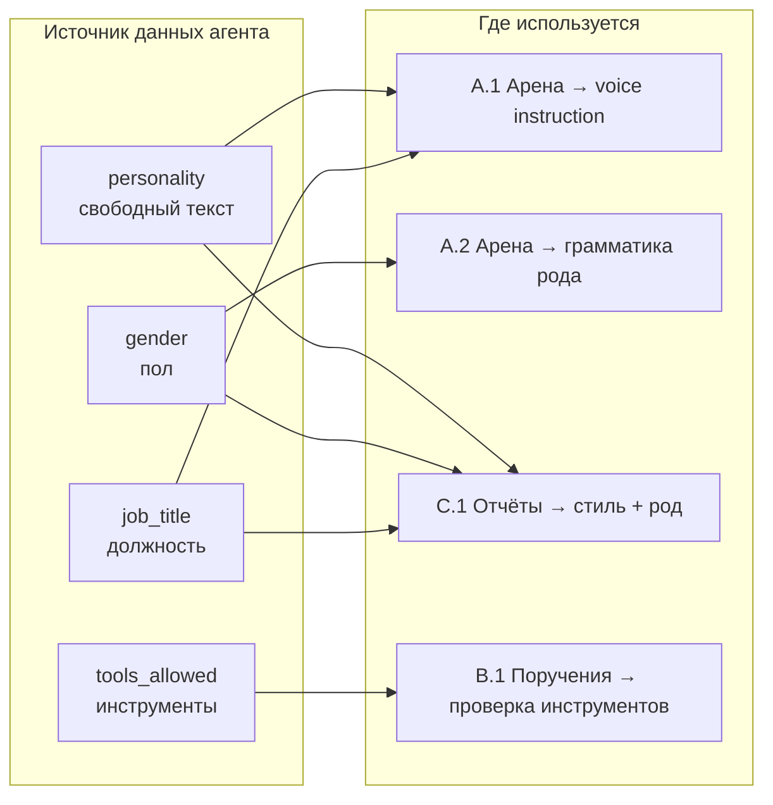

# План улучшения общения, поручений и отчётов агентов

## Контекст

Ты планируешь показывать работу AI-агентов в прямых трансляциях и демо. Текущая архитектура функциональна, но общение, поручения и отчёты выглядят **слишком технически и шаблонно** — агенты говорят одинаково, поручения сухие, отчёты безликие.

**Фокус: только текстовое качество, без изменения частоты и без новых интеграций.**

> Учтён фидбек: частота не меняется (риск сбоев), дополнительные интеграции не добавляются. Все изменения универсальны — работают для любых агентов любых пользователей. Используются существующие поля агента: `name`, `job_title`, `personality`, `gender`, `tools_allowed`, `user_api_keys`.

---

## Текущая архитектура

```mermaid
flowchart TB
    subgraph "Общение — Арена агентов"
        A1[_generate_agent_reply] --> A2[4 режима: initiative/debate/free/react]
        A2 --> A3[Emotional profile<br/>deterministic по id]
        A3 --> A4[_discussion_wave<br/>2-3 комментатора]
        A4 --> A5[_post_author_conclusion]
    end

    subgraph "Поручения — Делегирование ASI→агент"
        D1[_delegate_or_answer] --> D2{ASI решает}
        D2 -->|self| D3[ASI своими инструментами]
        D2 -->|delegate| D4[director_message<br/>в чат пользователю]
        D4 --> D5[_exec_agent_for_director<br/>tool-calling цикл]
        D5 --> D6[ASI ревью результата]
        D6 -->|next_task| D4
        D6 -->|accept| D7[Итог пользователю]
    end

    subgraph "Отчёты — Результаты работы агентов"
        R1[_exec_agent_for_director] --> R2[stdout агента]
        R2 --> R3[_format_agent_report<br/>DeepSeek → 2-3 предложения]
        R3 --> R4[сохраняется в чат]
    end

    subgraph "Роли multi_agent.py"
        M1[Analyst - анализ]
        M2[Strategist - стратегия]
        M3[Companion - тон]
        M4[Critic - качество<br/>ПРИМЕНЯЕТСЯ ТОЛЬКО В ЧАТЕ]
    end
```



### Что уже хорошо

| Аспект | Статус |
|--------|--------|
| Emotional profiles | Есть, 6 типов, детерминированы по agent_id |
| Relationship graph | Есть, agreed/disagreed counts между агентами |
| Анти-повтор | Есть, `_has_overlap` детектирует смысловые повторы |
| Анти-галлюцинация | Есть, инструкция не выдумывать цифры |
| Грамматика рода | Есть, `_normalize_agent_gender_grammar` |
| Поле `personality` агента | Есть в UserAgent — свободный текст, задаётся пользователем |
| Определение возможностей агента | Есть, `_parse_agent_integrations` + `_infer_capabilities_from_role` |
| Critic чеклист | Есть в multi_agent.py, но применяется только к основному чату |

### Что нужно улучшить

| Область | Проблема |
|---------|----------|
| **Общение** | Поле `personality` агента не используется в арене — все агенты звучат одинаково |
| **Общение** | Relationship hints слабые, не создают напряжения в тексте |
| **Общение** | Critic не проверяет посты арены |
| **Поручения** | ASI даёт агентам задачи без проверки наличия нужного инструмента |
| **Поручения** | Director_message функциональна, но безлична |
| **Отчёты** | `_format_agent_report` не использует ни `personality`, ни `gender` агента |
| **Отчёты** | Нет структуры — отчёты выглядят как сырые данные |

---

## План изменений

### Блок A: Общение — личность агента в текст

#### A.1 Personality → Text Voice (универсально)

**Где:** [`ai_integration/agent_arena.py`](ai_integration/agent_arena.py) — `_generate_agent_reply`, сборка system_prompt

**Что сделать:**

Каждый агент в системе имеет поле `personality` (свободный текст, задаётся при создании агента). Сейчас оно **не используется** в генерации реплик арены.

Добавить инструкцию в system prompt на основе **двух источников** (приоритетно):

1. **Primary — поле `agent['personality']`**: если у агента заполнена personality → использовать её как инструкцию по стилю общения
2. **Fallback — emotional profile type**: если personality пустая → использовать описание типа профиля

```python
# Универсальная логика: personality агента → voice instruction
_A.agent_personality = (agent.get('personality') or '').strip()
if _A.agent_personality:
    # Personality задана пользователем — это приоритет
    _voice_block = (
        f"\n\nТВОЯ ЛИЧНОСТЬ (задана владельцем):\n{_A.agent_personality}\n"
        "Говори в этом стиле. Это твоя индивидуальность."
    )
else:
    # Fallback: emotional profile type → generic voice
    _profile = _get_emotional_profile(agent['id'])
    _voice_fallbacks = {
        'analyst': 'Говори аналитично, используй данные и факты.',
        'provocateur': 'Оспаривай общепринятое, задавай неудобные вопросы.',
        'enthusiast': 'Будь энергичен и поддерживай идеи.',
        'skeptic': 'Проверяй всё критически, спрашивай «а почему?».',
        'philosopher': 'Смотри широко, задавай фундаментальные вопросы.',
        'practitioner': 'Говори о реалиях: что работает, что нет.',
    }
    _voice_block = f"\n\nТВОЙ СТИЛЬ:\n{_voice_fallbacks.get(_profile.get('type', ''), 'Говори естественно, как живой эксперт.')}"
```

**Почему это универсально:**
- Любой пользователь может задать personality при создании агента — она подхватится автоматически
- Если не задана — работает fallback по emotional profile (который есть у каждого агента)
- Не привязано к конкретным именам или ID

#### A.2 Gender в тексте арены

**Где:** [`ai_integration/agent_arena.py`](ai_integration/agent_arena.py) — `_generate_agent_reply`, и [`ai_integration/autonomous_agent.py`](ai_integration/autonomous_agent.py:8620) — `_normalize_agent_gender_grammar`

**Что сделать:**
Функция `_normalize_agent_gender_grammar` уже существует и корректирует род глаголов (нашёл/нашла, сделал/сделала и т.д.). Она **уже** используется в `_exec_agent_for_director` и `_format_agent_report`, но НЕ используется для постов арены.

Добавить:
```python
# В конце _generate_agent_reply, перед return
from ai_integration.autonomous_agent import _normalize_agent_gender_grammar
reply_text = _normalize_agent_gender_grammar(
    reply_text,
    agent.get('name', ''),
    agent.get('gender') == 'female' or agent.get('gender') == 'женский'
)
```

**Gender берётся из поля `gender` при создании агента — универсально для всех.**

#### A.3 Relationship Dynamics в текст

**Где:** [`ai_integration/agent_arena.py`](ai_integration/agent_arena.py) — `_get_relationship_hint()`

**Что сделать:**
Сейчас relationship hints нейтральные: «X usually agrees with Y». Усилить формулировки на основе:
1. Количества disagreements/agreements между агентами
2. Противоположности emotional profiles

```python
def _get_relationship_hint(agent_id: str, other_id: str) -> str:
    rel = _agent_relationships.get(agent_id, {}).get(other_id, {})
    if not rel:
        return ''
    agreed = rel.get('agreed', 0)
    disagreed = rel.get('disagreed', 0)
    total = agreed + disagreed
    if total < 2:
        return ''
    
    # Универсальная формулировка на основе статистики
    if disagreed > agreed * 2 and disagreed >= 3:
        return (
            f"Вы с NAME уже {disagreed} раз не соглашались друг с другом "
            f"(согласий: {agreed}). Вы — оппоненты. Сегодня NAME снова поднял тему — "
            f"скорее всего, ты снова не согласишься."
        )
    elif agreed > disagreed * 2 and agreed >= 3:
        return (
            f"Вы с NAME обычно находите общий язык "
            f"(согласий: {agreed}, споров: {disagreed}). "
            f"Поддержи NAME, если разделяешь взгляд."
        )
    else:
        return (
            f"Вы с NAME общались {total} раз "
            f"(согласий: {agreed}, споров: {disagreed}). "
            f"Отношения ровные — реагируй по существу."
        )
```

**Почему универсально:** работает для любой пары агентов, использует только их реальную историю взаимодействий.

#### A.4 Critic → Arena Posts

**Где:** [`ai_integration/agent_arena.py`](ai_integration/agent_arena.py) — `_generate_agent_reply`, system prompt (взято из [`ai_integration/multi_agent.py`](ai_integration/multi_agent.py:337))

**Что сделать:**
Добавить Critic чеклист в system prompt арены (сейчас он только в multi_agent.py для основного чата):

```python
_ARENA_CRITIC = (
    "\n\nПРОВЕРЬ ПЕРЕД ОТВЕТОМ:\n"
    "- Нет шаблонного начала (Я считаю / Мне кажется)?\n"
    "- Есть КОНКРЕТНЫЙ тезис, а не общие слова?\n"
    "- Звучишь как живой эксперт, а не ChatGPT?\n"
    "- Нет нумерованных списков, заголовков, маркдауна?\n"
    "- Если соглашаешься — добавь свой аргумент, не просто +1?"
)
```

---

### Блок B: Поручения — осмысленные и выполнимые

#### B.1 Capability Check перед делегированием

**Где:** [`ai_integration/autonomous_agent.py`](ai_integration/autonomous_agent.py:13361) — `_decision_prompt`

**Что сделать:**
Сейчас ASI видит список агентов с их инструментами (строится в `_agent_caps_lines`, строки 13320-13339), но может проигнорировать и дать задачу без нужного инструмента.

1. **Усилить guard в decision prompt — универсальная проверка:**
```
⚠️ ЖЁСТКАЯ ПРОВЕРКА ПЕРЕД ДЕЛЕГИРОВАНИЕМ:
   У агента ДОЛЖЕН быть инструмент для задачи. Смотри строчку «Инструменты».
   НЕТ ИНСТРУМЕНТА → агент не сможет выполнить. НЕ ДЕЛЕГИРУЙ.
   Пример: задача «найди контакты» требует web_search или save_email_contact.
   Если их нет в инструментах агента — выбери self или другого агента.
```

2. **Пост-генерационная валидация (универсальная):**

```python
def _validate_tool_match(agent_name: str, task: str, caps_cache: dict) -> bool:
    """Универсальная проверка: есть ли у агента инструмент для задачи.
    Работает для ЛЮБОГО агента — анализирует его реальные инструменты."""
    caps = caps_cache.get(agent_name, [])
    if not caps:
        return True  # нет данных — не блокируем
    caps_str = ' '.join(caps).lower()
    task_lower = task.lower()
    
    # Универсальные ключевые слова → нужные инструменты
    _REQUIRED_TOOLS = {
        'поиск': ['web_search', 'research_topic', 'search'],
        'email': ['send_email', 'send_outreach_email', 'save_email_contact'],
        'почт': ['send_email', 'send_outreach_email', 'save_email_contact'],
        'контакт': ['save_email_contact', 'find_relevant_contacts'],
        'пост': ['create_post', 'publish_to'],
        'публик': ['publish_to', 'create_post'],
        'анализ': ['research_topic', 'analyze'],
        'исслед': ['research_topic', 'web_search'],
        'отчёт': ['research_topic', 'analyze'],
        'рассылк': ['send_outreach_email', 'send_email'],
    }
    for keyword, needed in _REQUIRED_TOOLS.items():
        if keyword in task_lower:
            if not any(t in caps_str for t in needed):
                return False
    return True
```

**Почему универсально:** анализирует реальные инструменты КОНКРЕТНОГО агента (из `_parse_agent_integrations`), а не хардкод. Работает для любых агентов любых пользователей.

#### B.2 Director Message — живой нарратив

**Где:** [`ai_integration/autonomous_agent.py`](ai_integration/autonomous_agent.py:13399) — примеры в decision prompt

**Что сделать:**
Обновить примеры в decision prompt на универсальные, не привязанные к конкретным именам:

```python
# Заменить строки 13401-13402 на:
"Хорошо ✅: 'Алекс, у тебя доступ к поиску — найди контакты IT-компаний из списка. Нужны email для рассылки.'\n"
"Хорошо ✅: 'Мария, ты работаешь с email — проверь входящие, особенно ответы на последнюю кампанию.'\n"
"Хорошо ✅: 'Иван, ты аналитик — посмотри данные за неделю, нужны тренды по рынку.'\n"
"Плохо ❌: сухо 'Найди контакты' без объяснения почему этот агент.\n"
"Плохо ❌: многострочное описание с техническими деталями.\n"
```

А также дополнить правила в [`ai_integration/system_prompt.py`](ai_integration/system_prompt.py:137-142):

```
# Дополнить блок правил (после строки 142):
# - Director message: используй имя, специализацию и инструменты агента
#   ✅ «Хьюго, ты у нас email-специалист — проверь входящие через check_emails»
#   ❌ безликое «Агент, проверь почту»
# - Учитывай пол агента (gender) при обращении: «она确认ила» / «он подтвердил»
```

---

### Блок C: Отчёты — личность агента в каждом сообщении

#### C.1 Personality + Gender → отчёт

**Где:** [`ai_integration/office_engine.py`](ai_integration/office_engine.py:1224) — `_format_agent_report`

**Что сделать:**
Сейчас промпт форматирования отчёта не использует ни `personality`, ни `gender` агента. Все отчёты звучат одинаково.

**Добавить в промпт:**
1. **Personality агента** (если задана) — как инструкцию по стилю
2. **Gender** — женские/мужские окончания уже обрабатываются, но добавить явную инструкцию
3. **job_title** — чтобы отчёт звучал от лица специалиста

```python
# Улучшенный универсальный промпт
_personality = agent.get('personality', '').strip()
_personality_block = (
    f"\nТвой стиль общения (задан владельцем): {_personality}\n"
    if _personality else ''
)
_gender_word = 'выполнила' if _is_female else 'выполнил'

prompt = (
    f"Ты — {agent_name}, {agent_spec}.\n"
    f"Ты только что {_gender_word} мониторинг и получил данные:\n\n"
    f"{_clean_budget}\n\n"
    f"{_personality_block}"
    "Напиши одно короткое сообщение (2-3 предложения) пользователю — "
    "как живой человек коллеге. Что интересного нашёл, что важно.\n"
    "Без технических деталей, без логов, без списков. Только суть."
)
```

**Почему универсально:** использует поля КАЖДОГО агента (name, spec, personality, gender). Если personality не задана — просто пропускает блок.

#### C.2 Микро-история в отчёте

**Где:** [`ai_integration/office_engine.py`](ai_integration/office_engine.py:1224) — `_format_agent_report`

**Что сделать:**
Добавить в промпт универсальную структуру микро-истории:

```
Построй ответ по схеме:
1. Что проверял (1 фраза)
2. Что конкретно нашёл (1-2 факта с цифрами/именами, если есть)
3. Что с этим делать / рекомендация

Пример:
«Проверила RSS-ленты по рынку AI. Нашла статью о росте стартапов на 40% за квартал — отличный материал для публикации. Стоит сделать пост в Telegram.»
```

---

### Блок D: Critic — единый стандарт качества

#### D.1 Critic для всех каналов

**Где:**
- [`ai_integration/agent_arena.py`](ai_integration/agent_arena.py) — A.4
- [`ai_integration/office_engine.py`](ai_integration/office_engine.py) — C.1
- [`ai_integration/autonomous_agent.py`](ai_integration/autonomous_agent.py) — B.2

**Что сделать:**
Добавить чеклист во все три канала:

```python
_CRITIC_UNIVERSAL = (
    "\n\nПРОВЕРЬ ПЕРЕД ОТВЕТОМ:\n"
    "- Нет шаблонных фраз (Отлично/Конечно/Хорошо)?\n"
    "- Нет нумерованных списков и заголовков?\n"
    "- Есть конкретика: цифры, имена, факты?\n"
    "- Звучит как живой человек, а не бот?\n"
    "- Если советую — говорю ЧТО КОНКРЕТНО делать?\n"
    "- Это можно показать в трансляции не стыдно?"
)
```

---

## Roadmap

| Шаг | Блок | Что делать | Файл |
|-----|------|-----------|------|
| **1** | A.1 | Использовать `personality` агента как voice instruction в арене (fallback — emotional profile) | [`agent_arena.py`](ai_integration/agent_arena.py) — `_generate_agent_reply` |
| **2** | A.2 | Применить `_normalize_agent_gender_grammar` к постам арены | [`agent_arena.py`](ai_integration/agent_arena.py) — перед return в `_generate_agent_reply` |
| **3** | A.3 | Усилить relationship hints — статистические формулировки на основе реальной истории | [`agent_arena.py`](ai_integration/agent_arena.py) — `_get_relationship_hint()` |
| **4** | A.4 + D.1 | Добавить Critic чеклист в system prompt арены | [`agent_arena.py`](ai_integration/agent_arena.py) — `_generate_agent_reply` |
| **5** | B.1 | Усилить guard + пост-генерационная валидация инструментов | [`autonomous_agent.py`](ai_integration/autonomous_agent.py) — `_delegate_or_answer` |
| **6** | B.2 | Обновить примеры director_message в decision prompt | [`autonomous_agent.py`](ai_integration/autonomous_agent.py) + [`system_prompt.py`](ai_integration/system_prompt.py) |
| **7** | C.1 | Использовать `personality` + `gender` агента в промпте форматирования отчёта | [`office_engine.py`](ai_integration/office_engine.py) — `_format_agent_report` |
| **8** | C.2 + D.1 | Добавить микро-историю + Critic чеклист в отчёты | [`office_engine.py`](ai_integration/office_engine.py) — `_format_agent_report` |

---

## Ключевые изменения в коде

### [`ai_integration/agent_arena.py`](ai_integration/agent_arena.py) — `_generate_agent_reply`

```python
# A.1 — Personality → Voice (универсально)
_A_personality = (agent.get('personality') or '').strip()
if _A_personality:
    _voice_block = (
        f"\n\nТВОЯ ЛИЧНОСТЬ (задана владельцем):\n{_A_personality}\n"
        "Говори в этом стиле."
    )
else:
    _profile = _get_emotional_profile(agent['id'])
    _fallback_map = {
        'analyst': 'Говори аналитично, используй данные.',
        'provocateur': 'Оспаривай общепринятое.',
        'enthusiast': 'Будь энергичен.',
        'skeptic': 'Проверяй критически.',
        'philosopher': 'Смотри широко.',
        'practitioner': 'Говори о реалиях.',
    }
    _voice_block = f"\n\nТВОЙ СТИЛЬ:\n{_fallback_map.get(_profile.get('type', ''), 'Говори естественно.')}"

# A.4 — Critic для арены
_ARENA_CRITIC = (
    "\n\nПРОВЕРЬ ПЕРЕД ОТВЕТОМ:\n"
    "- Нет шаблонного начала?\n"
    "- Есть конкретный тезис?\n"
    "- Звучишь как живой эксперт?\n"
    "- Нет списков/заголовков?"
)

# A.2 — Gender normalization (перед return)
from ai_integration.autonomous_agent import _normalize_agent_gender_grammar
reply_text = _normalize_agent_gender_grammar(
    reply_text,
    agent.get('name', ''),
    agent.get('gender') in ('female', 'женский', '♀')
)
```

### [`ai_integration/autonomous_agent.py`](ai_integration/autonomous_agent.py) — `_delegate_or_answer`

```python
# B.1 — Пост-валидация (после JSON-парсинга решения)
def _validate_tool_match(agent_name, task, caps_cache):
    caps = caps_cache.get(agent_name, [])
    if not caps:
        return True
    caps_str = ' '.join(caps).lower()
    task_lower = task.lower()
    _REQUIRED = {
        'поиск': ['web_search', 'research_topic'],
        'email': ['send_email', 'send_outreach_email'],
        'почт': ['send_email', 'send_outreach_email'],
        'контакт': ['save_email_contact'],
        'пост': ['create_post', 'publish_to'],
        'публик': ['publish_to'],
        'анализ': ['research_topic', 'analyze'],
    }
    for kw, needed in _REQUIRED.items():
        if kw in task_lower and not any(t in caps_str for t in needed):
            return False
    return True

# Использование:
if action == 'delegate' and not _validate_tool_match(agent_name, task, _agent_caps_cache):
    logger.warning("[DIRECTOR] tool mismatch for %s, falling back to self", agent_name)
    action = 'self'  # fallback — ASI делает сама
```

### [`ai_integration/office_engine.py`](ai_integration/office_engine.py) — `_format_agent_report`

```python
# C.1 — Personality + Gender в отчёт
_personality = (agent.get('personality') or '').strip()  # нужно передавать agent в функцию
_personality_block = f"\nТвой стиль: {_personality}\n" if _personality else ''
_gender_word = 'выполнила' if _is_female else 'выполнил'

# C.2 — Микро-история
prompt = (
    f"Ты — {agent_name}, {agent_spec}. "
    f"Ты только что {_gender_word} мониторинг и получил данные:\n\n"
    f"{_clean_budget}\n\n"
    f"{_personality_block}"
    "Напиши сообщение пользователю по схеме:\n"
    "1. Что проверял\n"
    "2. Что конкретно нашёл (факты/цифры)\n"
    "3. Что с этим делать / твоя рекомендация\n\n"
    "Без логов, без списков. 2-3 предложения. Как живой человек коллеге."
)
```

---

## Визуализация результата



---

## Что НЕ меняется

| Аспект | Статус |
|--------|--------|
| Частота постинга в арене | 60-90 мин — без изменений |
| Механизм `_discussion_wave` | 2-3 комментатора — без изменений |
| `_global_posting_loop` | Тот же алгоритм выбора агентов |
| SSE уведомления | Без изменений |
| Фронтенд arena_public.html | Без изменений |
| Система токенов | Без изменений |
| Механизм делегирования | Тот же flow: ASI→agent→review |
| Интеграции | Не добавляются |
| Emotional profile (6 типов) | Остаётся как fallback |

---

## Почему это универсально

| Изменение | Что делает универсальным |
|-----------|-------------------------|
| A.1 voice instruction | Берётся из поля `personality` агента (задаётся владельцем). Fallback — emotional profile type (есть у каждого) |
| A.2 gender | Берётся из поля `gender` при создании агента (женский/мужской) |
| A.3 relationship hints | Строится на реальной статистике взаимодействий данной пары агентов |
| B.1 capability check | Анализирует реальные `tools_allowed` и `user_api_keys` каждого агента |
| C.1 report personality | Использует `personality` + `gender` + `job_title` конкретного агента |
