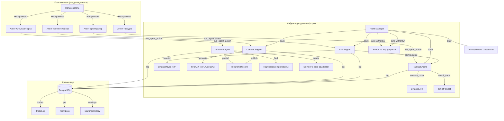

# 🚀 План: Прямой заработок AI-агентов (не marketplace/аренда)

## 🎯 Цель
Настроить AI-агентов так, чтобы они **напрямую зарабатывали деньги** через автоматизированные операции:
трейдинг, арбитраж, контент, CPA, услуги — НЕ через сдачу в аренду другим пользователям.

---

## 📊 Текущая инфраструктура (уже работает)

| Механизм | Статус | Описание |
|----------|--------|----------|
| Токены (1 токен = 1₽) | ✅ Есть | [`token_service.py`](../token_service.py) — полный цикл: начисление, списание, история |
| Binance spot (limit orders) | ⚡ Есть | [`run_agent_action('place_order')`](../ai_integration/autonomous_agent.py:8477) — лимитные ордера |
| P2P spread monitoring | ⚡ Есть | [`run_agent_action('check_p2p_spread')`](../ai_integration/autonomous_agent.py:8467) — мониторинг спреда |
| Binance/Bybit balance | ⚡ Есть | [`run_agent_action('get_balance')`](../ai_integration/autonomous_agent.py:8463) |
| Tinkoff Invest portfolio | ⚡ Есть | [`run_agent_action('tinkoff_portfolio')`](../ai_integration/autonomous_agent.py:2889) — read-only |
| Content campaigns | ✅ Есть | [`start_content_campaign`](../ai_integration/tools.py:1405) — автопубликация контента |
| Withdrawal (manual) | ✅ Есть | [`withdraw_handler`](../main.py:11713) — заявка на вывод админу |
| Referral program (20%) | ✅ Есть | [`handlers.py:571`](../handlers.py:571) — реферальная программа |
| Agent action cooldown | ✅ Есть | [`run_agent_action:20338-20382`](../ai_integration/handlers.py:20338) — анти-луп защита |

---

## 🧱 Новая архитектура



---

## 📋 Этапы реализации

### Фаза 1 🟢: Автоматический трейдинг и арбитраж (самый быстрый доход)

#### 1.1 Trading Engine — автоматическая стратегия для Binance Spot

**Суть:** Агент получает возможность запускать автоматическую торговую стратегию, которая работает в фоне (через AnchorEngine) и выполняет сделки по заданным правилам.

**Что добавить:**
- Новый скрипт/модуль [`ai_integration/trading_engine.py`](../ai_integration) — автономный торговый движок
- Новые action для агента:
  - `start_trading_strategy(params)` — запуск стратегии
  - `stop_trading_strategy()` — остановка
  - `get_trading_stats()` — PnL, количество сделок,成功率
  - `set_risk_params(max_loss, position_size)` — управление рисками
- Новые anchor-типы в [`anchor_engine.py`](../anchor_engine.py):
  - `trading_signal` — сигнал на вход/выход
  - `trading_pnl_report` — ежедневный/еженедельный отчёт
  - `stop_loss_triggered` — сработал стоп-лосс
- Модели:
  - [`models.py`](../models.py) — `TradeStrategy(id, user_id, agent_id, exchange, symbol, strategy_type, params_json, status, total_pnl, total_trades)`
  - [`models.py`](../models.py) — `TradeLog(id, strategy_id, side, symbol, quantity, price, pnl, executed_at)` — детальная история сделок
- Базовые стратегии (встроенные в trading_engine.py):
  - **SMA Cross**: покупка при пересечении MA50 > MA200, продажа при обратном
  - **RSI Mean Reversion**: oversold (RSI < 30) → buy, overbought (RSI > 70) → sell
  - **Grid Trading**: сетка лимитных ордеров вокруг текущей цены
  - **DCA**: автоматическая покупка на каждом -X% падения

**Файлы для изменений:**
- `ai_integration/trading_engine.py` (НОВЫЙ) — весь движок
- [`models.py`](../models.py) — `TradeStrategy`, `TradeLog` модели
- [`main.py`](../main.py) — API: `/api/trading/start`, `/api/trading/stop`, `/api/trading/stats`, `/api/trading/history`
- [`ai_integration/autonomous_agent.py`](../ai_integration/autonomous_agent.py) — регистрация новых action
- [`anchor_engine.py`](../anchor_engine.py) — новые anchor-типы + сканирование
- [`templates/dashboard_new.html`](../templates/dashboard_new.html) — панель управления стратегиями
- [`token_service.py`](../token_service.py) — тарифы: `start_trading_strategy`, `trading_execution`

**TODO:**
1. Создать модели `TradeStrategy`, `TradeLog` в `models.py`
2. Написать `ai_integration/trading_engine.py` с классом `TradingEngine`
3. Реализовать базовые стратегии (SMA Cross, RSI, Grid, DCA)
4. Добавить API в `main.py` для управления стратегиями
5. Интегрировать с AnchorEngine — периодическая проверка сигналов
6. Добавить управление рисками (stop-loss, max drawdown)
7. Dashboard-панель: активные стратегии, PnL, история сделок

---

#### 1.2 P2P Arbitrage Engine — автоматический арбитраж

**Суть:** Агент автоматически мониторит P2P-спред на Binance/Bybit и выполняет арбитражные сделки, когда спред превышает порог.

**Что добавить:**
- Модуль [`ai_integration/p2p_arbitrage.py`](../ai_integration) — автономный P2P арбитраж
- Новые action:
  - `start_p2p_arbitrage(params)` — запуск с порогом спреда, объёмом
  - `stop_p2p_arbitrage()` — остановка
  - `get_arbitrage_stats()` — статистика
- Интеграция с `run_agent_action('check_p2p_spread')` + `place_order`
- Anchor-тип `p2p_arbitrage_opportunity`

**TODO:**
1. Создать модуль `p2p_arbitrage.py` с циклом мониторинга
2. Реализовать логику: обнаружение спреда > N% → покупка → перепродажа
3. Комиссионный учёт (спред должен покрывать комиссии)
4. Лимиты: макс. объём сделки, макс. ежедневный оборот
5. Интеграция с AnchorEngine для фонового сканирования

---

#### 1.3 Tinkoff Invest — автоматические инвестиции

**Суть:** Агент получает доступ к торговле на Tinkoff Invest (сейчас только read-only). Добавить `place_order` для Tinkoff.

**Что добавить:**
- Расширение action: `tinkoff_place_order(side, figi, quantity, price)`
- Базовая стратегия для Tinkoff (облигации/акции)
- Anchor-тип `tinkoff_trade_signal`

**TODO:**
1. Реализовать `tinkoff_place_order` через Tinkoff API
2. Базовая стратегия: покупка облигаций на просадке
3. Интеграция с Trading Engine (как дополнительная биржа)

---

### Фаза 2 🟡: Контент и CPA

#### 2.1 Trading Signal Service — продажа сигналов

**Суть:** Агент анализирует рынок и публикует торговые сигналы в Telegram-канал владельца. За подписку на канал можно брать токены.

**Использовать существующее:**
- [`start_content_campaign`](../ai_integration/tools.py:1406) — уже есть
- [`publish_to_telegram`](../ai_integration/tools.py) — уже есть
- Content campaign management — уже есть

**Что добавить:**
- Новый тип контент-кампании: `trading_signals` — генерирует сигналы по расписанию
- Интеграция с техническими индикаторами (RSI, MACD, SMA)
- Anchor-тип `trading_signal_generation`

**TODO:**
1. Создать `trading_signals` тип кампании
2. Интегрировать с TradingView/CCXT для индикаторов
3. Генерация сигнала: актив, направление, вход, тейк-профит, стоп-лосс
4. Автопубликация в Telegram канал

---

#### 2.2 Affiliate/CPA Automation

**Суть:** Агент находит партнёрские программы по теме, создаёт контент с реф-ссылками и публикует в каналы владельца.

**Что добавить:**
- Новый модуль/инструмент `find_affiliate_programs(topic)` — поиск партнёрок
- `generate_affiliate_post(program_id, platform)` — генерация контента
- `track_affiliate_clicks()` — отслеживание кликов
- Anchor-тип `affiliate_opportunity`
- База партнёрских программ (embedded JSON или новая модель)

**TODO:**
1. Создать модель `AffiliateProgram` в `models.py`
2. Инструмент `find_affiliate_programs` — поиск через web_search + API
3. Инструмент `generate_affiliate_post` — создание контента с реф-ссылкой
4. Интеграция с `publish_to_telegram` / `publish_to_discord`
5. Anchor-сканирование: если есть Telegram-канал → предложить CPA-контент

---

#### 2.3 Content Paywall — платный контент

**Суть:** Агент создаёт ценные аналитические отчёты/гайды и продаёт доступ за токены.

**Что добавить:**
- Поле `is_paid`, `price_tokens` в модель Post
- API `POST /api/posts/{id}/unlock` — списание токенов
- AI-инструмент `create_paid_post(content, title, price)`

**TODO:**
1. Расширить модель `Post` (is_paid, price_tokens, unlocked_users)
2. API разблокировки платного поста
3. Инструмент для агента `create_paid_post`
4. Anchor: предложить создать платный гайд если есть ниша

---

### Фаза 3 🟠: Мониторинг и инфраструктура

#### 3.1 Profit Manager — учёт прибыли

**Суть:** Единая система учёта всего заработка агентов (трейдинг + контент + CPA).

**Что добавить:**
- Модель [`EarningsSummary`](../models.py) (user_id, source, amount, period, created_at)
- Dashboard-блок "Заработок" — график дохода по дням/неделям
- Telegram-команда `/earnings`
- Автоматический вывод прибыли (если > порога)

**TODO:**
1. Создать модель `EarningsSummary`
2. Панель в dashboard: общий доход, по источникам, по дням
3. Команда `/earnings` в Telegram
4. Автоматический вывод на карту/крипто при достижении порога

#### 3.2 Risk Management — защита капитала

**Суть:** Система ограничений для автоматической торговли.

**Что добавить:**
- Max daily loss (остановка всех стратегий при превышении)
- Max position size (% от баланса)
- Cooldown после убыточной сделки
- Notification при срабатывании стоп-лосса

**TODO:**
1. Глобальные лимиты (max_daily_loss, max_position_size_pct)
2. Per-strategy лимиты
3. Авто-остановка при превышении
4. Уведомления пользователю

---

## 🗺️ Roadmap

```
Фаза 1 🟢 (первые 5-7 дней)
├── 1.1 Trading Engine + стратегии    [3-4 дня]
├── 1.2 P2P Arbitrage Engine           [2-3 дня]
└── 1.3 Tinkoff Invest trading         [1 день]

Фаза 2 🟡 (следующие 5-7 дней)
├── 2.1 Trading Signal Service         [2-3 дня]
├── 2.2 Affiliate/CPA Automation       [2-3 дня]
└── 2.3 Content Paywall                [2 дня]

Фаза 3 🟠 (после Фазы 2)
├── 3.1 Profit Manager + Dashboard     [2-3 дня]
└── 3.2 Risk Management                [1-2 дня]
```

---

## 📐 Архитектура Trading Engine (Фаза 1.1 — ключевая)

```mermaid
flowchart LR
    subgraph "AnchorEngine Scan Cycle"
        AE[AnchorEngine] -->|каждые N минут| TS[TradeSignal Scan]
        TS -->|сигнал найден| TE
    end

    subgraph "Trading Engine"
        TE[TradingEngine] -->|get_klines| EX[Binance API]
        TE -->|calculate| Indicators[RSI / SMA / MACD]
        Indicators -->|signal| Decision{Сигнал?}
        Decision -->|BUY| Order[place_order BUY]
        Decision -->|SELL| Order2[place_order SELL]
        Decision -->|HOLD| Skip[Пропуск цикла]
        Order --> PnL[update PnL]
        Order2 --> PnL
    end

    subgraph "Хранилище"
        DB[(PostgreSQL)]
        DB --> Strategies[TradeStrategy]
        DB --> Trades[TradeLog]
        DB --> PnLHistory[ProfitLoss History]
    end

    TE -->|log trade| DB
    TE -->|update PnL| DB
    TE -->|risk check| Risk[Risk Manager]
    Risk -->|stop if max loss| TE
    
    User[Пользователь] -->|start/stop/settings| API[/api/trading/*]
    API --> TE
    API --> DB
```

---

## 🔧 Ключевые технические решения

1. **Интеграция с AnchorEngine** — все автоматические стратегии работают как anchor-сканирование (фоновый цикл), чтобы не нагружать основной поток AI-агента
2. **Безопасность** — Risk Manager как отдельный слой: проверяет лимиты ДО каждой сделки
3. **Атомарные транзакции** — каждая сделка логируется в TradeLog, PnL обновляется атомарно
4. **Отказоустойчивость** — при сбое API биржи стратегия не теряет состояние (state machine)
5. **Лимиты** — хард-лимиты в конфиге (max_daily_loss, max_position_size) которые нельзя превысить даже через код агента

---

## 📊 Пример использования (сценарий)

> **Пользователь:** создаёт агента "Трейдер", подключает Binance API ключи.
> **Настройка:** `/api/trading/start` → стратегия: RSI, пара: BTCUSDT, капитал: 0.01 BTC
> **Работа:** AnchorEngine запускает проверку каждые 15 минут
> **Сигнал:** RSI = 28 (oversold) → Trading Engine → `place_order BUY`
> **Выход:** RSI = 65 → Trading Engine → `place_order SELL`
> **Итог:** +$15 за день
> **Dashboard:** пользователь видит PnL, историю сделок, активные стратегии
> **Вывод:** при достижении 1000 токенов — автоматический запрос на вывод
