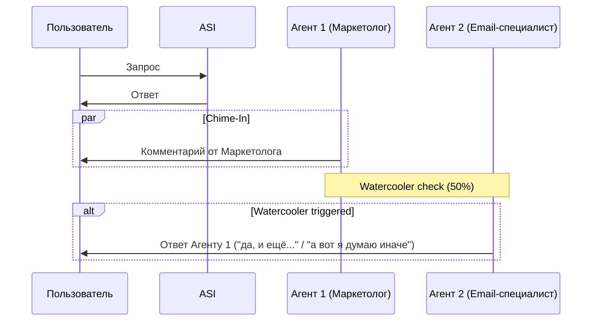
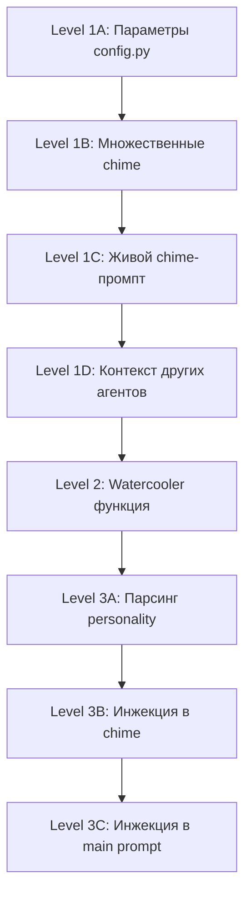

# План имплементации: Levels 1-3

## Текущая архитектура chime-In

```
Пользователь -> запрос
  -> ASI отвечает (process_request)
  -> Запускается _agent_chimes_in() как фоновая задача
     -> 15% вероятность
     -> 8 мин cooldown на каждого агента
     -> Выбирается 1 агент (по релевантности или случайно)
     -> LLM генерирует 1-3 предложения с жёстким промптом
     -> Отправляется в чат
```

---

## Level 1: Улучшенный Chime-In

### Файлы изменений

1. [`ai_integration/autonomous_agent.py`](ai_integration/autonomous_agent.py:8317) — `_agent_chimes_in()`
2. [`config.py`](config.py) — добавить параметры стрим-режима

### Что меняем

#### 1A. Параметры вероятности и cooldown

```python
# Новые параметры в config.py (или env vars)
STREAM_MODE_CHIME_PROBABILITY = 0.4   # вместо 0.15
STREAM_MODE_CHIME_COOLDOWN = 3        # минут, вместо 8
CHIME_MAX_AGENTS_SEQUENCE = 2         # макс агентов в одной последовательности
CHIME_SEQUENCE_DELAY_SEC = (3, 7)     # задержка между chime-сообщениями
```

#### 1B. Множественные chime-In

Вместо выбора 1 агента — выбирать топ-N релевантных (CHIME_MAX_AGENTS_SEQUENCE) и запускать последовательно с задержкой.

**Логика:**
```python
# После выбора первого агента — НЕ ВЫХОДИМ, а проверяем ещё
_scored = [...]  # все агенты с рейтингом релевантности
_scored.sort(key=lambda x: x[0], reverse=True)
_selected = _scored[:CHIME_MAX_AGENTS_SEQUENCE]
if _selected[0][0] == 0:  # никто не релевантен
    _selected = random.sample(_agents, min(len(_agents), CHIME_MAX_AGENTS_SEQUENCE))

# Запускаем последовательно
for _agent_candidate in _selected:
    asyncio.ensure_future(
        _single_chime(_agent_candidate, user_message, asi_response, user_id, user_db_id)
    )
    await asyncio.sleep(random.uniform(*CHIME_SEQUENCE_DELAY_SEC))
```

#### 1C. Живой chime-промпт (без жёстких ограничений)

Заменить текущий жёсткий промпт (строки 8460-8500) на более живой:

```python
_system = (
    f"Ты — {agent_name}.\n"
    f"Твоя роль: {agent_role}.\n"
    f"Твой характер: {personality}\n\n"
    "Ты участвуешь в разговоре в чате. Реагируй естественно:\n"
    "- Можешь согласиться, дополнить, пошутить, поспорить\n"
    "- Используй свой характер и стиль общения\n"
    "- Говори от первого лица в рамках своей экспертизы\n"
    "- Не придумывай факты, которых нет в разговоре\n"
    "- 1-4 предложения, коротко и живо\n"
    "- Если сказать нечего — верни пустую строку\n"
)
```

**Убрать:**
- Жёсткое разделение на «режим отчёта» и «режим комментария»
- Запрет на фразы «я сделала»
- Формальные заголовки

**Оставить:**
- Запрет на придумывание фактов
- Краткость (1-4 предложения)
- Возможность вернуть пустую строку

#### 1D. Передача контекста других агентов

Добавить в промпт информацию о том, что сказали другие агенты ранее:

```python
_other_chimes = _get_recent_agent_messages(user_db_id, minutes=5)
if _other_chimes:
    _system += f"\nНедавние реплики коллег:\n{_other_chimes}\n"
    _system += "Можешь ответить им, дополнить или пошутить. Если нечего — пустая строка.\n"
```

---

## Level 2: Watercooler (агентские мини-дискуссии)

### Новый механизм

После того как первый агент chime-In отправил сообщение, другие агенты могут «подхватить» тему и продолжить.

### Логика



### Файлы изменений

1. [`ai_integration/autonomous_agent.py`](ai_integration/autonomous_agent.py) — новая функция `_agent_watercooler()`
2. [`ai_integration/autonomous_agent.py`](ai_integration/autonomous_agent.py:8317) — дополнить `_agent_chimes_in()` вызовом watercooler

### Детали

#### Функция `_agent_watercooler(prev_agent_msg, prev_agent_name, user_id, user_db_id)`

1. **Trigger:** вызывается ПОСЛЕ отправки chime-In сообщения
2. **Вероятность:** 50% (или параметр `WATERCOOLER_PROBABILITY = 0.5`)
3. **Выбор агента:** другой агент (не тот, что только что chimed)
4. **Cooldown:** отдельный, 2 минуты (watercooler ≠ chime)
5. **Промпт:**
```
Ты — {agent_name}, {role}.
Твой характер: {personality}

Твой коллега {prev_agent_name} только что сказал:
"{prev_agent_msg}"

Ты можешь:
- Согласиться и добавить факт/мнение со своей стороны
- Вежливо не согласиться и аргументировать
- Пошутить (если это в твоём характере)
- Дополнить с точки зрения своей специализации

Правила:
- 1-3 предложения
- Не придумывай факты
- Обращайся к коллеге по имени
- Если сказать нечего — верни пустую строку
```
6. **Защита от зацикливания:** максимум 2 watercooler-реплики подряд, затем пауза 5 минут

---

## Level 3: Динамические личности

### Подход: парсинг существующего поля personality

Поскольку у каждого пользователя уже есть `personality` в БД, и она может быть в свободном формате, мы НЕ добавляем новые поля, а **обогащаем промпт** на основе анализа существующей personality.

### Файлы изменений

1. [`ai_integration/user_agents.py`](ai_integration/user_agents.py:104) — `build_agent_system_prompt()`
2. [`ai_integration/autonomous_agent.py`](ai_integration/autonomous_agent.py:8460) — chime-промпт

### Что делаем

#### 3A. Парсинг personality

```python
def _enrich_personality_prompt(personality_text: str) -> str:
    """Анализирует текст personality и добавляет инструкции по стилю."""
    if not personality_text.strip():
        return ""
    
    lower = personality_text.lower()
    enrichments = []
    
    # Определяем стиль общения
    if any(w in lower for w in ['саркастич', 'язвительн', 'циничн', 'остроум']):
        enrichments.append("- Можно использовать сарказм и остроумие, но не переходить на личности")
    if any(w in lower for w in ['восторжен', 'энтузиазм', 'энергичн', 'позитив']):
        enrichments.append("- Приветствуется энтузиазм и позитивный настрой")
    if any(w in lower for w in ['сух', 'формальн', 'лаконичн', 'деловой']):
        enrichments.append("- Предпочитай деловой и лаконичный стиль")
    if any(w in lower for w in ['дружелюбн', 'тёпл', 'душевн', 'заботлив']):
        enrichments.append("- Будь дружелюбным и тёплым в общении")
    
    # Определяем склонность к юмору
    if any(w in lower for w in ['шут', 'юмор', 'смешн', 'ирони']):
        enrichments.append("- Можешь шутить, если уместно")
    
    # Определяем активность
    if any(w in lower for w in ['молчалив', 'тих', 'спокоен', 'наблюдател']):
        enrichments.append("- Ты сдержан в общении, говори только по делу")
    
    return "\n".join(enrichments)
```

#### 3B. Инжекция в chime-промпт

```python
# После personality (строка 8470)
_personality_enrichment = _enrich_personality_prompt(_agent_personality_chime)
if _personality_enrichment:
    _system += f"СТИЛЬ ОБЩЕНИЯ:\n{_personality_enrichment}\n\n"
```

#### 3C. Инжекция в основной промпт

В `build_agent_system_prompt()` добавить:
```python
_personality_enrichment = _enrich_personality_prompt(personality)
if _personality_enrichment:
    overlay += f"\nСТИЛЬ ОБЩЕНИЯ:\n{_personality_enrichment}\n"
```

---

## Универсальность (для любых пользователей и агентов)

Все изменения работают для **любого** агента любого пользователя, потому что:

1. **Chime-In** использует существующие поля: `personality`, `specialization`, `name`, `gender` — они есть у всех агентов
2. **Watercooler** не зависит от имён — выбирает любого другого активного агента
3. **Личности** парсятся из существующего текстового поля `personality` — не требуют новых полей в БД
4. **Вероятности** настраиваются через `config.py` — можно включить/выключить для конкретного пользователя

### Если нужно отключить для конкретного пользователя

Добавить в модель пользователя флаг:
```python
# models.py
stream_agent_chatter = Column(Boolean, default=False)
```

И проверять перед chime/watercooler:
```python
if not user.stream_agent_chatter:
    return
```

---

## План реализации (Todo)



### Todo list

1. **Level 1A**: Добавить `STREAM_MODE_CHIME_PROBABILITY`, `CHIME_COOLDOWN_MINUTES`, `CHIME_MAX_AGENTS_SEQUENCE`, `CHIME_SEQUENCE_DELAY_SEC` в [`config.py`](config.py)
2. **Level 1B**: Изменить `_agent_chimes_in()` для поддержки множественных агентов (очередь с задержкой)
3. **Level 1C**: Переписать chime-промпт на более живой и свободный
4. **Level 1D**: Добавить контекст недавних сообщений других агентов в chime-промпт
5. **Level 2**: Создать `_agent_watercooler()` — обсуждение между агентами после chime
6. **Level 3**: Создать `_enrich_personality_prompt()` — парсинг стиля из personality
7. **Level 3**: Интегрировать enrich в `build_agent_system_prompt()` и chime-промпт
