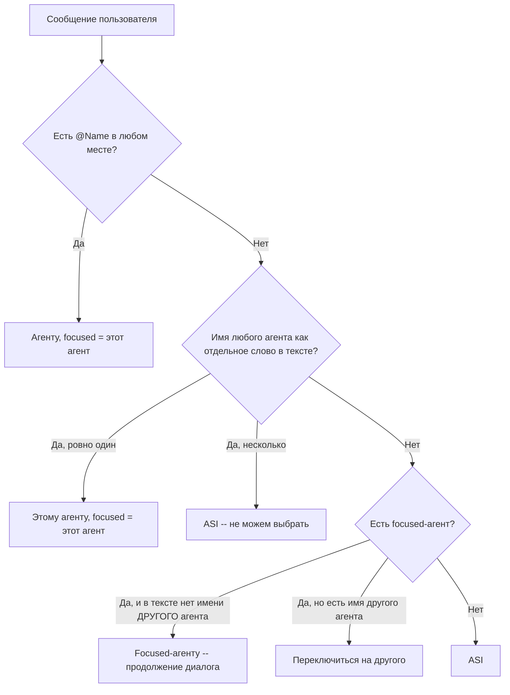

# План: Умная маршрутизация сообщений к AI-агентам

## Проблема

Пользователь пишет "Беатрис есть новые письма на почте", а ответ приходит от Bella, а не от ASI.

## Корень

Текущая логика в [`autonomous_agent.py:4858-4963`](../ai_integration/autonomous_agent.py:4858):

1. @Name **только в начале** сообщения → роутинг агенту
2. Первое слово без @ = имя агента → тихий роутинг агенту
3. **Focused-агент перехватывает ВСЁ** → сообщение "Беатрис есть..." уходит Bella (focused)
4. Если ничего не сработало → ASI

## Новая логика

## Изменения в коде

### Файл: `ai_integration/autonomous_agent.py`, строки 4858-4963

1. **@Name в любом месте**: заменить `re.match(r'@(\w+)\b', ...)` на `re.findall(r'(?<!\w)@(\w+)\b', ...)` — ищем все @упоминания по всему тексту
2. **Тихий роутинг**: заменить проверку только первого слова на поиск имени агента как `\bword\b` во всём тексте
3. **Focused check**: если focused есть, проверить не содержит ли сообщение имя ДРУГОГО агента (через `\bword\b`)
4. **Удаление @Name из сообщения**: удаляем все @Name в любых позициях (не только из начала)

### Поведение после изменений

| Сценарий | Результат |
|----------|-----------|
| `привет` | ASI |
| `@Bella проверь почту` | Bella + focused=Bella |
| `что там по письмам?` (после Bella) | Bella (продолжение) |
| `Bella что с письмами?` | Bella + focused=Bella |
| `Беатрис есть письма?` (нет агента Беатрис) | ASI (если нет focused) |
| `Беатрис есть письма?` (focused=Bella) | ASI (имя не совпало с активными агентами) |
| `привет @Bella` | Bella + focused=Bella |
| `пусть Beatrice проверит почту` | Beatrice + focused=Beatrice |
