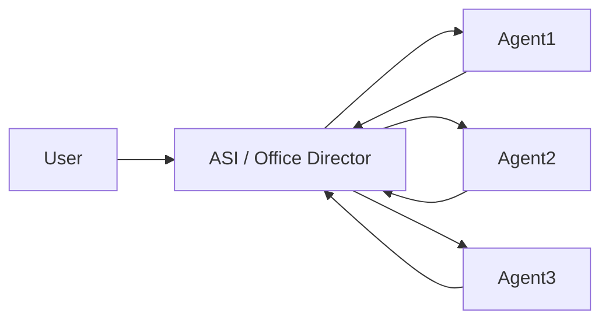
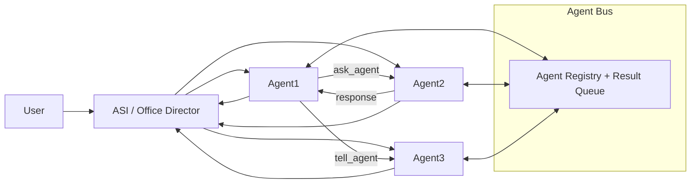
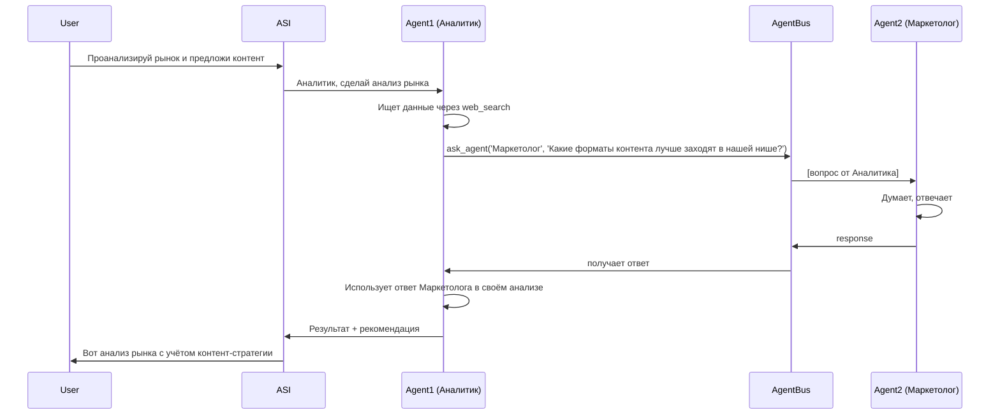

# План: Agent-to-Agent Chat (прямое общение агентов)

## Текущая архитектура (ASINH)



**Проблема:** Все сообщения проходят через ASI. Если Agent1 хочет спросить Agent2, он пишет в ответ ASI, ASI переформулирует и отправляет Agent2, Agent2 отвечает ASI, ASI пересказывает Agent1. Это:
- Удваивает токены (каждый диалог перегоняется через ASI)
- Теряет контекст (ASI может неверно переформулировать)
- Замедляет работу (лишний LLM call)
- Противоречит "человеческому" общению — коллеги говорят напрямую

## Целевая архитектура



## Изменения (в порядке выполнения)

---

### Изменение 1: AgentBus — реестр агентов и очередь результатов

**Файл:** [`ai_integration/autonomous_agent.py`](ai_integration/autonomous_agent.py) — в глобальной области, после `_DIRECTOR_CTX_CACHE` (строка ~12316)

**Что добавить:** Глобальный словарь + очередь для меж-агентной коммуникации.

```python
# Agent-to-Agent communication bus
# Структура: { agent_name: { 'task': ..., 'response': ..., 'expires': float } }
_AGENT_BUS: dict[str, dict] = {}
_AGENT_BUS_LOCK = None  # asyncio.Lock, инициализируется при первом использовании

def _get_agent_bus_lock() -> asyncio.Lock:
    global _AGENT_BUS_LOCK
    if _AGENT_BUS_LOCK is None:
        _AGENT_BUS_LOCK = asyncio.Lock()
    return _AGENT_BUS_LOCK

async def _agent_bus_send(recipient_name: str, question: str, sender_name: str) -> dict | None:
    """Отправить вопрос агенту. Возвращает ответ или None если агент не найден."""
    # Поиск агента по имени среди активных
    # Помещаем вопрос в _AGENT_BUS[recipient_name.lower()] = { 'question': ..., 'sender': ..., 'response': None, 'expires': ... }
    # Возвращаем None — ответ будет получен через _agent_bus_poll
    pass

async def _agent_bus_poll(my_name: str, timeout: float = 15.0) -> dict | None:
    """Ждёт вопроса в шине, адресованного мне. Возвращает вопрос или None по таймауту."""
    # Цикл: проверяет _AGENT_BUS[my_name.lower()] каждые 2с, ждёт пока question появится
    # Возвращает вопрос, удаляет его из шины
    pass

async def _agent_bus_respond(recipient_name: str, response: str) -> None:
    """Отправить ответ агенту."""
    # Помещает ответ в _AGENT_BUS[sender_lock_key]['response'] = response
    pass
```

**Логика:**
- `_AGENT_BUS` — временное хранилище сообщений между агентами
- Каждое сообщение живёт максимум 30 секунд (TTL)
- Агенты общаются по имени (case-insensitive)
- Только один активный диалог на агента в момент времени

---

### Изменение 2: Новый инструмент `ask_agent` в tools.py

**Файл:** [`ai_integration/tools.py`](ai_integration/tools.py) — добавить новую tool-декларацию

**Описание инструмента:**
```python
{
    "type": "function",
    "function": {
        "name": "ask_agent",
        "description": "Задать вопрос другому агенту команды и получить ответ. "
                       "Используй когда тебе нужны данные/мнение/помощь коллеги. "
                       "Параметр agent_name — имя агента (из списка КОМАНДА КОЛЛЕГ). "
                       "Параметр question — чёткий вопрос, что именно нужно. "
                       "Агент ответит в том же сообщении.",
        "parameters": {
            "type": "object",
            "properties": {
                "agent_name": {
                    "type": "string",
                    "description": "Имя агента, которому задаёшь вопрос"
                },
                "question": {
                    "type": "string",
                    "description": "Текст вопроса — что нужно узнать"
                }
            },
            "required": ["agent_name", "question"]
        }
    }
}
```

**Также добавить в список** инструментов, которые имеют приоритет («once_only_tools» или подобное), чтобы AI не спамил вопросами.

Обновить `EXCLUDED_TOOLS` — НЕ исключать `ask_agent`.

---

### Изменение 3: Новый инструмент `tell_agent` в tools.py

**Файл:** [`ai_integration/tools.py`](ai_integration/tools.py)

```python
{
    "type": "function",
    "function": {
        "name": "tell_agent",
        "description": "Отправить информацию/факт/результат другому агенту. "
                       "Используй когда нашёл данные, которые нужны коллеге для его задачи. "
                       "Параметр agent_name — имя агента. "
                       "Параметр message — что передать.",
        "parameters": {
            "type": "object",
            "properties": {
                "agent_name": {
                    "type": "string",
                    "description": "Имя агента-получателя"
                },
                "message": {
                    "type": "string",
                    "description": "Сообщение/данные для агента"
                }
            },
            "required": ["agent_name", "message"]
        }
    }
}
```

---

### Изменение 4: Хендлер `ask_agent` в handlers.py

**Файл:** [`ai_integration/handlers.py`](ai_integration/handlers.py) — добавить после `delegate_task` (строка ~3856)

```python
async def ask_agent(agent_name: str, question: str, user_id: int = None) -> str:
    """
    Задать вопрос другому агенту.
    1. Проверяет что агент с таким именем существует у пользователя
    2. Помещает вопрос в AgentBus
    3. Запускает агента-получателя через _exec_agent_for_director с задачей: "Ответь на вопрос: {question}"
    4. Получает ответ и возвращает его
    """
```

**Логика работы:**
1. Хендлер принимает `agent_name` и `question`
2. Ищет агента по имени в `_agents` (через `_find_agent`)
3. Создаёт задачу для агента: `"Ответь на вопрос от {sender_name}: {question}"`
4. Запускает `_exec_agent_for_director(agent, task, user_id)` — **но** с флагом `_is_agent_to_agent=True`, который:
   - Убирает сохранение в Interaction (чтобы не засорять чат пользователя)
   - Убирает `_send_visible` (промежуточные сообщения не видны пользователю)
   - Сокращает max_tokens (быстрый ответ)
5. Получает ответ и возвращает его как строку

**Важно:** Хендлер ДОЛЖЕН быть асинхронным и использовать `asyncio.wait_for` с таймаутом 15-20 секунд, чтобы не блокировать основной поток.

---

### Изменение 5: Хендлер `tell_agent` в handlers.py

```python
async def tell_agent(agent_name: str, message: str, user_id: int = None) -> str:
    """
    Отправить данные другому агенту.
    Сохраняет сообщение в AgentBus для получателя.
    Агент-получатель увидит это при следующем запуске.
    """
```

**Логика:**
1. Сохраняет сообщение в `_AGENT_BUS[recipient_name]` с ключом `received_messages`
2. Возвращает подтверждение: `"Информация передана агенту {agent_name}"`
3. Агент-получатель при следующем запуске видит `[ВХОДЯЩЕЕ СООБЩЕНИЕ ОТ {sender}]` в контексте

---

### Изменение 6: Интеграция в _exec_agent_for_director — контекст входящих сообщений

**Файл:** [`ai_integration/autonomous_agent.py`](ai_integration/autonomous_agent.py) — в функции `_exec_agent_for_director()`, после строки ~9240 (после загрузки правил пользователя)

**Что добавить:** Инжект входящих сообщений от других агентов в system_prompt.

```python
# ── Входящие сообщения от других агентов ──────────────────────────
try:
    _agent_bus_lock_in = _get_agent_bus_lock()
    async with _agent_bus_lock_in:
        _my_bus_in = _AGENT_BUS.get(agent.get('name', '').lower())
        if _my_bus_in and _my_bus_in.get('received_messages'):
            _incoming_msgs = _my_bus_in['received_messages'][-5:]  # последние 5
            _incoming_block = '\n'.join(
                f"  • От {m['sender']}: {m['text'][:300]}"
                for m in _incoming_msgs
            )
            system_prompt += (
                f"\n\n[ВХОДЯЩИЕ СООБЩЕНИЯ ОТ КОЛЛЕГ — ответь на них или используй в работе]:\n"
                f"{_incoming_block}"
            )
            # Очищаем прочитанные
            _my_bus_in['received_messages'] = []
except Exception:
    pass
```

---

### Изменение 7: Обновление КОМАНДА КОЛЛЕГ в _exec_agent_for_director

**Файл:** [`ai_integration/autonomous_agent.py`](ai_integration/autonomous_agent.py) — строка ~9315

**Текущий текст:**
```
"КОМАНДА КОЛЛЕГ (делегируй ТОЛЬКО если у тебя нет нужного инструмента — иначе делай сам):\n"
```

**Новый текст:**
```
"КОМАНДА КОЛЛЕГ:\n"
"  • Ты можешь задать вопрос коллеге через ask_agent(agent_name='Имя', question='...').\n"
"  • Ты можешь отправить данные коллеге через tell_agent(agent_name='Имя', message='...').\n"
"  • Используй ask_agent когда нужны данные/мнение коллеги.\n"
"  • Используй tell_agent когда нашёл информацию для другого агента.\n"
"  • НЕ используй ask_agent для простых вопросов — сначала попробуй свои инструменты.\n"
```

---

### Изменение 8: Обновление system_prompt.py — правила для агентов

**Файл:** [`ai_integration/system_prompt.py`](ai_integration/system_prompt.py) — в секции `## АГЕНТЫ (команда)` (строка ~134)

**Добавить в RU-промпт:**
```
- Агенты могут общаться друг с другом через ask_agent и tell_agent
- Если агенту нужны данные из другой специализации — пусть спросит коллегу напрямую
- Если агент нашёл данные, полезные другому — пусть отправит через tell_agent
- ASI не переводит разговоры агентов — они говорят сами
```

**Добавить в EN-промпт:**
```
- Agents can talk to each other via ask_agent and tell_agent
- If an agent needs data from another specialization — ask the colleague directly
- If an agent found data useful for another — send via tell_agent
- ASI does not translate agent conversations — they talk directly
```

---

### Изменение 9: Добавление ask_agent/tell_agent в allowed_tools для всех агентов

**Файл:** [`ai_integration/autonomous_agent.py`](ai_integration/autonomous_agent.py)

**Где:** В секциях формирования `_autopilot_tools` (строка ~9510) и `_inferred_tools` (строка ~9637)

**Добавить `ask_agent` и `tell_agent` в базовый набор для ВСЕХ агентов:**
```python
# Agent-to-agent коммуникация — доступна всем
_autopilot_tools.update({'ask_agent', 'tell_agent'})
_inferred_tools.update({'ask_agent', 'tell_agent'})
```

---

## Схема вызова



---

## Приоритет выполнения

| № | Изменение | Файл | Сложность | Зависит от |
|---|-----------|------|-----------|------------|
| 1 | AgentBus (глобальная шина) | `autonomous_agent.py` | 🟢 30 мин | — |
| 2 | Tool `ask_agent` + `tell_agent` | `tools.py` | 🟢 15 мин | 1 |
| 3 | Хендлер `ask_agent` | `handlers.py` | 🟡 1ч | 1, 2 |
| 4 | Хендлер `tell_agent` | `handlers.py` | 🟢 20 мин | 1, 2 |
| 5 | Интеграция в _exec_agent_for_director | `autonomous_agent.py` | 🟡 30 мин | 1 |
| 6 | Обновление команды коллег | `autonomous_agent.py` | 🟢 10 мин | — |
| 7 | Обновление system_prompt | `system_prompt.py` | 🟢 10 мин | — |
| 8 | Добавление в allowed_tools | `autonomous_agent.py` | 🟢 10 мин | 2 |

**Всего:** ~3-4 часа работы

---

## Риски и решения

| Риск | Решение |
|------|---------|
| Агенты зациклятся (Agent1 → Agent2 → Agent1 → ...) | Глубина рекурсии `_depth` уже есть в `_exec_agent_for_director` (лимит 2). Для agent-to-agent добавить отдельный `_a2a_depth` с лимитом 1. |
| Агент тратит токены на бесконечные вопросы коллегам | `ask_agent` добавить в `_runtime_banned` защиту: если вызывается >3 раз за 24ч — блокируется. |
| Ответ агента не приходит (timeout) | Асинхронный таймаут 20 секунд. Если не ответил — возвращать `"Агент {name} сейчас занят, попробуй позже"`. |
| Два агента одновременно спрашивают друг друга | AgentBus использует asyncio.Lock. Каждый агент может обрабатывать только 1 входящий запрос за раз. |
| Сообщение теряется при перезапуске | AgentBus in-memory. При перезапуске все сообщения теряются — это нормально для живого чата. |
