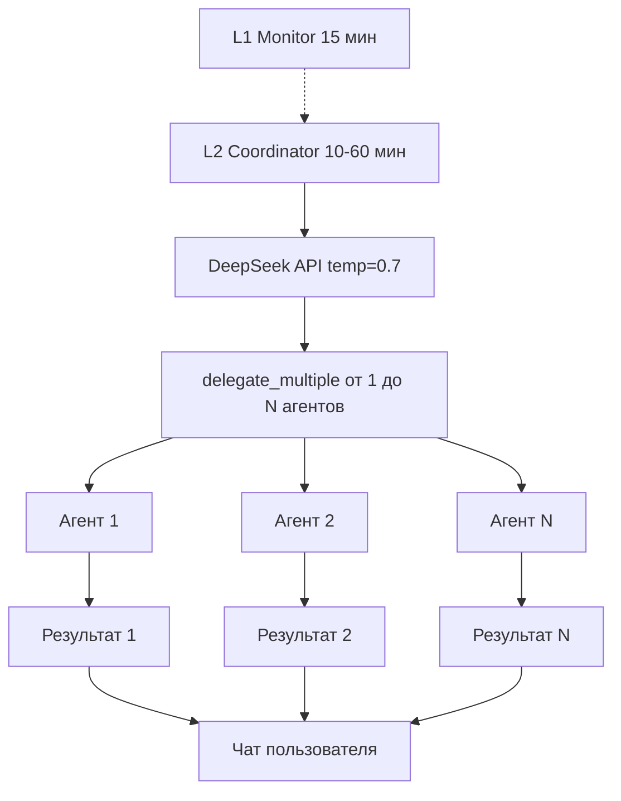

# План: Множественные агенты за цикл автопилота

## Текущая проблема

При 8 подключённых агентах и 4 целях пользователь видит сообщение только 1 агента за цикл автопилота. Прирост эффективности от добавления новых агентов отсутствует.

## Архитектура

```
L2 Coordinator (30-60 мин)
  │
  ├─ Собирает цели (max 5), агентов (max 10), статистику 24ч
  ├─ Строит промпт AI
  ├─ AI выбирает: delegate (1 агент) / delegate_multiple (max 3) / wait
  ├─ [:3] hard cap на assignments
  ├─ Сохраняет в AgentActivityLog (НИКОГО НЕ ЗАПУСКАЕТ)
  │
  └─ L1 Monitor (15 мин) ← запускает python_code напрямую
      └─ Director (_office_director_chat) ← запускается при сообщении юзера
```

**Ключевая проблема**: L2-координатор — это «советчик с блокнотом». Он записывает кому что делать, но агентов не запускает. Агенты запускаются только через L1 (по таймеру 15-60 мин) или через директора (когда юзер пишет).

---

## Пункт 1: Убрать single delegate из промпта

**Файл**: [`ai_integration/office_engine.py:1785-1789`](ai_integration/office_engine.py:1785)

**Что сделать**: Заменить в промпте строку JSON-формата так, чтобы `delegate` (одиночный) не предлагался. Только:
```json
{"action": "delegate_multiple", "assignments": [{"agent_name": "...", "task": "...", "goal": "...", "urgency": "normal"}, ...]}
```
или
```json
{"action": "wait", "reason": "..."}
```

Также убрать из промпта текст `или {"action": "delegate", "agent_name": "имя", ...}`.

И удалить блок `elif action == 'delegate':` (строки 1839-1846), оставив только `delegate_multiple`.

Добавить в промпт инструкцию: «Назначай задачи МИНИМУМ 2 агентам за цикл. Распределяй задачи между агентами чтобы каждый двигал свою часть целей.»

---

## Пункт 2: Убрать hard cap [:3]

**Файл**: [`ai_integration/office_engine.py:1838`](ai_integration/office_engine.py:1838)

**Что сделать**: Заменить `[:3]` на весь список:
```python
_assignments = plan.get('assignments', [])
```
Без лимита. AI сам решит сколько агентов достаточно — от 1 до 8 (всех доступных).

---

## Пункт 3: Убрать/уменьшить 30-min cooldown

**Файл**: [`ai_integration/office_engine.py:1372-1386`](ai_integration/office_engine.py:1372)

**Что сделать**: Уменьшить cooldown с 30 минут до 10 минут.

Либо переделать логику: не блокировать весь L2 цикл, а проверять только те же инструменты/задачи (anti-loop). У нас уже есть `_skip_by_tool_dedup` ниже в коде (строка 1940-1957), который блокирует повторение одних и тех же инструментов — этого достаточно для защиты от зацикливания.

Вариант: убрать cooldown вовсе, оставив только tool-dedup защиту.

---

## Пункт 4: Повысить AI temperature до 0.7

**Файл**: [`ai_integration/office_engine.py:1799`](ai_integration/office_engine.py:1799)

**Что сделать**: 
```python
# Было:
"temperature": 0.4,
# Стало:
"temperature": 0.7,
```

Это заставит AI пробовать разные комбинации агентов, а не застревать на одном паттерне.

---

## Пункт 5: L2 реально запускает агентов

**Файл**: [`ai_integration/office_engine.py:2019-2029`](ai_integration/office_engine.py:2019)

**Текущий код** (только логирование):
```python
_auto_delegate_to_agent_sync(
    user_db_id, _agent_id, _agent_name_db,
    f'Цель: {_agoal[:120]}. {_atask[:600]}',
)
```

**Что сделать**: Заменить на вызов `_exec_agent_for_director()` для каждого делегированного агента. Поскольку `_exec_agent_for_director` — асинхронная функция из `autonomous_agent.py`, надо импортировать и вызвать её.

```python
# Вместо _auto_delegate_to_agent_sync — реальный запуск
from ai_integration.autonomous_agent import _exec_agent_for_director

# Собираем контекст для агента
_agent_context = (
    f"ЦЕЛИ:\n{goals_text}\n\n"
    f"АКТИВНОСТЬ 6Ч:\n{activity_text}\n\n"
    f"{_failed_tasks_l2}"
)

# Запускаем агента
_agent_task = f'Цель: {_agoal[:120]}. {_atask[:600]}'
agent_dict = {
    'id': _agent_id,
    'name': _agent_name_db,
    'specialization': _agent_spec or '',
    'description': _agent_desc or '',
    'python_code': '',  # будет загружено внутри _exec_agent_for_director
    'user_api_keys': '',  # будет загружено внутри
    'tools_allowed': '[]',
}
resp = await _exec_agent_for_director(
    agent_dict, _agent_task, user.telegram_id,
    dialog_context=_agent_context,
)
```

Логирование (`_auto_delegate_to_agent_sync`) можно оставить для аудита, но добавить к нему реальный запуск.

---

## Пункт 6: Async fan-out (параллельный запуск)

**Файл**: [`ai_integration/office_engine.py:1853-2029`](ai_integration/office_engine.py:1853)

**Текущий код**: последовательный `for _asgn in _assignments:`

**Что сделать**: Заменить на `asyncio.gather` для параллельного запуска:

```python
import asyncio

async def _process_assignment(_asgn):
    """Обработать одно назначение агента."""
    # ... вся логика из for _asgn in _assignments ...
    _aname = (_asgn.get('agent_name') or _asgn.get('agent') or '').strip()
    # ... валидация, anti-loop, quality guard ...
    # ... запуск агента ...
    return (_aname, result)

# Параллельный запуск
_results = await asyncio.gather(
    *[_process_assignment(a) for a in _assignments],
    return_exceptions=True,
)
```

**Важно**: каждое assignment должно быть независимым (использовать свои DB-сессии, свои AI-сессии). Нужно убедиться, что нет race conditions по общим данным.

---

## Логический порядок реализации

1. **Пункт 1** (убрать single delegate) + **Пункт 4** (temperature 0.7) — быстрые изменения в промпте, сразу заставят AI назначать больше агентов
2. **Пункт 2** (убрать cap) — дать AI полную свободу выбора
3. **Пункт 3** (убрать cooldown) — увеличить частоту циклов
4. **Пункт 5** (L2 запускает агентов) — самое объёмное изменение, превращает L2 из «советчика» в «исполнителя»
5. **Пункт 6** (async fan-out) — финальная оптимизация параллелизма

## Mermaid-диаграмма: целевая архитектура



## Ожидаемый эффект

С 8 агентами и 4 целями:
- Каждый L2-цикл (10-60 мин) AI будет распределять задачи между 3-6 агентами
- Каждый агент получит задачу, релевантную его специализации
- Пользователь увидит сообщения от нескольких агентов за цикл
- Async fan-out сократит общее время цикла (агенты работают параллельно)
