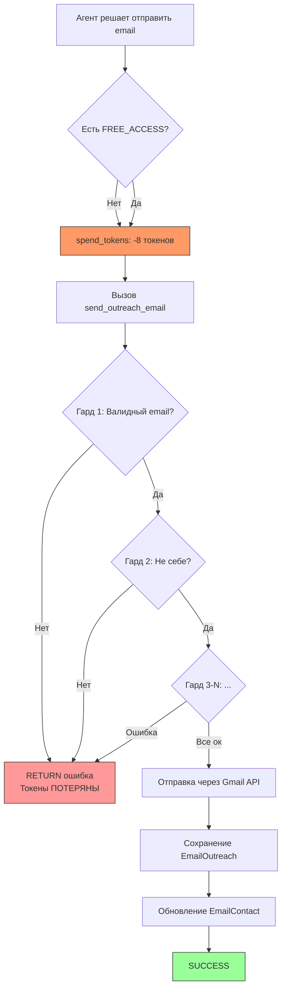

# План исправления email-рассылки

## Выявленные проблемы

### Проблема 1 (КРИТИЧЕСКАЯ): Токены сгорают впустую при отклонении гардами

**Где**: [`ai_integration/autonomous_agent.py:3686-3696`](../ai_integration/autonomous_agent.py:3686)

**Суть**: Токены списываются ДО вызова `send_outreach_email`. Если любой из ~15 гардов отклоняет письмо, токены НЕ ВОЗВРАЩАЮТСЯ.

**Данные из БД**:
- 3,790 списаний `send_outreach_email` (сумма -35,833 токена)
- ВСЕГО 20 записей в `email_outreach` (18 sent + 2 replied)
- Соотношение: ~189 списаний на 1 реальное письмо

**Механизм**:
```python
# Строка 3690: списание ДО вызова
token_result = spend_tokens(user_id, tool_name, description=reason)
if not token_result['success']:
    continue  # не хватило токенов

# Строка 3702: вызов функции (которая может вернуть ошибку гарда)
result = await handler_func(**params)
```

**Надо**: Либо возвращать токены при отказе, либо проверять возможность отправки ДО списания.

---

### Проблема 2: Избыточные гарды блокируют отправку

**Где**: [`ai_integration/handlers.py:14378-15374`](../ai_integration/handlers.py:14378)

**Полный список гардов (в порядке выполнения)**:

1. `:14400` — Пользователь не найден
2. `:14486` — Email на внутреннего агента команды
3. `:14506` — Невалидный email
4. `:14537` — Email на свою же почту
5. `:14541` — Email на домен платформы (asibiont.com)
6. `:14549` — Заблокированные домены (linkedin, noreply и т.д.)
7. `:14564` — .gov / .edu / .mil домены
8. `:14570` — Фейковый / generic email
9. `:14574` — Зарегистрированному пользователю платформы
10. `:14585` — Фейковое имя получателя
11. `:14650` — Плейсхолдеры в теле письма
12. `:14664` — Отсутствие персонализации по имени
13. `:14691` — Зарегистрированным в системе (дубль)
14. `:14707` — Отписавшимся / bounced
15. `:14720` — Тем, кто уже ответил
16. `:14755` — Отсутствие Gmail OAuth
17. `:14846` — AAL dedup (10 мин)
18. `:14866` — Дубликат в кампании
19. `:14903` — Глобальная дедупликация 30 дней
20. `:14926` — Кросс-кампания cooldown 14 дней
21. `:14968` — Hard bounce
22. `:15025` — Запрещённые слова в теме
23. `:15059` — Язык письма не совпадает с языком контакта
24. `:15118` — MX проверка домена

**Проблема**: Многие гарды проверяют то, что уже должно быть отфильтровано на уровне агента (например, "не пиши забаненные слова" — агент ДОЛЖЕН сам их избегать). Но DeepSeek регулярно их генерирует, и вместо мягкой фильтрации (поправить тему) — жёсткий RETURN.

---

### Проблема 3: 647 contacted контактов vs 20 отправленных

**Где**: [`ai_integration/handlers.py:15290-15314`](../ai_integration/handlers.py:15290)

**Суть**: Статус `contacted` устанавливается в 2х местах:
- При успешной отправке (`send_outreach_email` строка 15305) — 396 контактов
- Через `save_email_contact` напрямую — остальные 251

**Данные**:
- `outreach` source: 396 contacted
- `web_search` source: 170 contacted
- Остальные: github, manual, etc.

**Проблема**: Агенты массово сохраняют контакты через `save_email_contact` (1,525 вызовов, -1,976 токенов), но не могут отправить им письма. 44 контакта со статусом `new` так и не получили писем.

---

### Проблема 4: Завышенный расход токенов на не-email действия

**Данные за сегодня (2026-05-15)**: -9,716 токенов
- `arena_agent_post`: 6,523 раз (-103,795 всего) — арена сжирает больше всего
- `proactive_message`: 4,908 раз (-100,123 всего)
- `web_search`: 15,080 раз (-69,845 всего)

**Вывод**: Агенты слишком много тратят на веб-поиск, арену и проактивные сообщения, вместо фокуса на email.

---

### Проблема 5: Нет возврата токенов при отказе гарда

**Где**: [`token_service.py:225-334`](../token_service.py:225)

**Суть**: `spend_tokens()` делает атомарный UPDATE и COMMIT. Нет механизма rollback'а или refund'а.

```python
# atomic UPDATE с RETURNING
UPDATE users SET token_balance = token_balance - :cost 
WHERE telegram_id = :tid AND COALESCE(token_balance, 0) >= :cost 
RETURNING id, token_balance
```

Если `spend_tokens` вернул `success=True`, токены ушли безвозвратно. Даже если `send_outreach_email` сразу вернул `"⛔ Тема содержит запрещённое слово"`.

---

### Проблема 6: Auto-default кампании создаются agent_name=agent@asibiont.com

**Где**: [`ai_integration/handlers.py:14793-14805`](../ai_integration/handlers.py:14793)

**Суть**: Если нет активной кампании, автоматически создаётся дефолтная с `sender_email='outreach@asibiont.com'`. Эта почта настроена только на чтение (IMAP), Gmail OAuth отправляет через личную Gmail пользователя, но в письме указывается `outreach@asibiont.com`. Это может вызывать проблемы с доставляемостью (SPF/DKIM).

---

## План исправлений

### Шаг 1: Изоляция — проверять ДО списания токенов

**Файл**: [`ai_integration/autonomous_agent.py:3686-3696`](../ai_integration/autonomous_agent.py:3686)

**Изменение**: Вставить быструю pre-check функцию, которая проверяет базовые условия ДО списания токенов:
- Email не пустой
- Email содержит @ и домен
- Не в чёрном списке (быстрая проверка)
- Контакт не отписан (быстрая проверка)

**Логика**:
```python
# pre-check: базовые условия без списания токенов
if tool_name == 'send_outreach_email' and not FREE_ACCESS_MODE:
    # Делаем легковесную проверку через функцию-валидатор
    pre_ok, pre_msg = _precheck_send_outreach(params, user_id)
    if not pre_ok:
        results.append({"tool": tool_name, "success": False,
                        "error": pre_msg, "reason": reason})
        continue  # токены НЕ списаны
```

---

### Шаг 2: Возврат токенов при отказе гардов

**Файлы**: [`token_service.py`](../token_service.py) + [`ai_integration/handlers.py:14378-15374`](../ai_integration/handlers.py:14378)

**Вариант A (рекомендуемый)**: Добавить в `send_outreach_email` параметр `skip_token_check=True` для вызовов из агента. Токены списывать только после успешной отправки.

**Вариант B**: Добавить функцию `refund_tokens(user_id, action)` в `token_service.py`, которая возвращает токены. Вызывать в `send_outreach_email` перед каждым `return` с ошибкой гарда.

**Вариант C**: Переместить списание токенов ВНУТРЬ `send_outreach_email`, сразу перед Gmail API отправкой (после всех гардов).

**Рекомендую Вариант C**: 
1. Убрать списание в [`autonomous_agent.py:3690`](../ai_integration/autonomous_agent.py:3690) для `send_outreach_email`
2. Добавить вызов `spend_tokens()` внутри [`send_outreach_email`](../ai_integration/handlers.py:14378) сразу перед строкой 15178 (отправка через Gmail API), после всех гардов

---

### Шаг 3: Оптимизация гардов — мягкая фильтрация вместо жёсткого RETURN

**Файл**: [`ai_integration/handlers.py:14378-15374`](../ai_integration/handlers.py:14378)

Для следующих гардов заменить `return "ошибка"` на автоматическое исправление:

| Гард | Сейчас | Надо |
|------|--------|------|
| Запрещённые слова в теме (:15050) | return | Авто-замена слов через replace |
| Отсутствие персонализации (:14664) | return | Добавить приветствие в начало body |
| Плейсхолдеры (:14650) | return | Заменить плейсхолдеры на реальные данные |
| Отсутствие subject/body (:14978) | Уже есть fallback | Оставить как есть (работает) |
| Язык не совпадает (:15110) | return | Предупреждение в лог, но продолжить |

---

### Шаг 4: Приоритизация новых контактов

**Файл**: [`anchor_engine.py:23777-23926`](../anchor_engine.py:23777) (`_scan_email_outreach`)

**Изменение**: В сканере email-анкоров, приоритизировать anchors для контактов со статусом `new`:
- `email_need_leads` — если новых контактов < 10, создавать anchor на поиск новых лидов
- `email_outreach_send` — в первую очередь для `new` контактов
- `email_follow_up` — только если новых контактов 0 И прошло >=3 дня

---

### Шаг 5: Лимит кампаний

**Файл**: [`anchor_engine.py:23777-23926`](../anchor_engine.py:23777)

Проверить/добавить логику daily_limit кампании:
- Campaign 244: daily_limit=100, max_emails=50, sent_today=18 (но кампания создана сегодня в 12:50, прошло ~4 часа)
- Campaign 245: daily_limit=50, max_emails=50, sent_today=2
- Campaign 246: daily_limit=10, max_emails=30, sent_today=0

Лимиты看起来 работают. Но письма могли бы идти активнее.

---

### Шаг 6: Проверка статуса агента по email

**Где**: [`ai_integration/autonomous_agent.py`](../ai_integration/autonomous_agent.py)

**Изменение**: После вызова `send_outreach_email`, анализировать результат. Если результат содержит `"⛔"` (ошибка гарда) — делать вывод:
- Токены потрачены зря → учитывать это
- Улучшать качество генерации (feedback loop)
- Не повторять ту же ошибку в том же цикле

---

## Диаграмма потока



**Проблема**: Этап C (списание токенов) происходит ДО всех гардов. Нужно перенести его на позицию между H и I.

---

## Предлагаемые изменения (TODO)

1. **[autonomous_agent.py](../ai_integration/autonomous_agent.py:3686)** — Убрать `spend_tokens` для `send_outreach_email` из общего цикла. Добавить `_precheck_send_outreach()`.
2. **[handlers.py:14378-15374](../ai_integration/handlers.py:14378)** — Добавить вызов `spend_tokens()` сразу перед GMAIL API отправкой (строка ~15178). 
3. **[handlers.py](../ai_integration/handlers.py:15050)** — Заменить жёсткий `return` на авто-исправление для banned subject words.
4. **[handlers.py](../ai_integration/handlers.py:14650)** — Заменить плейсхолдеры на реальные данные вместо return.
5. **[anchor_engine.py:23777](../anchor_engine.py:23777)** — Приоритизировать `new` контакты в `_scan_email_outreach`.
6. **[token_service.py](../token_service.py)** — Добавить функцию `refund_tokens()` для экстренных случаев.
