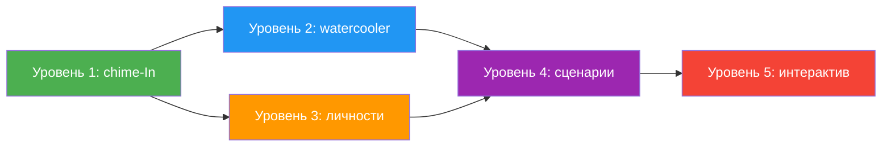

# План: как сделать диалоги агентов интересными для стрима

## Текущее состояние

### Механизмы общения агентов

| Механизм | Описание | Частота | Проблема |
|----------|----------|---------|----------|
| **Chime-In** [`_agent_chimes_in()`](ai_integration/autonomous_agent.py:8317) | Агент «вклинивается» в разговор пользователя с ASI | 15% вероятность, 8 мин cooldown | 1-3 предложения, очень формально, только «комментарий» |
| **Основной диалог** [`process_request`](ai_integration/autonomous_agent.py:4996) | Агент отвечает на запрос пользователя через @Name | По команде | Слишком деловой, без личности |
| **Цепочка агентов** [`_maybe_continue_chain`](anchor_engine.py:12036) | ASI передаёт задачу другому агенту | По необходимости | Только результат, без «живого» обмена |
| **Автопилот** [`_run_coordinator_dispatch`](anchor_engine.py:13010) | ASI-координатор управляет агентами в фоне | Циклически | Отчёты сухие, технические |

### Ключевые ограничения

1. Chime-In жёстко ограничен режимом «комментарий» — агент НЕ может сказать «я сделала»
2. Промпт запрещает агентам задавать вопросы пользователю
3. Нет механизма спонтанного общения между агентами (только через ASI-координатора)
4. 8-минутный cooldown на chime — слишком большой для стрима
5. Personality агентов загружается, но используется минимально

---

## Стратегия: 5 уровней вовлечения

### Уровень 1: Улучшить Chime-In (быстро, низкий риск)

**Текущий chime-промпт** (строки 8460-8500):
- Строгий режим «комментарий» — нельзя говорить от первого лица
- Максимум 1-3 предложения
- 15% вероятность, 8 мин cooldown

**Что изменить:**

#### A. Увеличить частоту chime-In для стрима
- Сделать `chime_probability` конфигурируемым параметром
- Для стрима: 40-60% вместо 15%
- Сократить cooldown с 8 мин до 2-3 мин для стрим-режима

#### B. Сделать chime-промпт более живым
- Убрать жёсткое ограничение «только комментарий»
- Добавить элементы характера: сарказм, энтузиазм, экспертный тон
- Разрешить агентам спорить друг с другом и с ASI
- Добавить «ice breaker» фразы

#### C. Множественные chime-In
- Сейчас вклинивается только 1 агент
- Сделать возможность для 2-3 агентов последовательно (с задержкой 3-5 сек между ними)

### Уровень 2: Agent Watercooler (спонтанные мини-дискуссии)

Новый механизм: после выполнения задачи агенты не просто отчитываются, а обсуждают результаты между собой.

**Как это работает:**

1. ASI выполняет задачу → публикует результат
2. Затрагиваются агенты, чья специализация релевантна теме
3. Запускается **мини-дискуссия** (2-3 реплики между агентами):
   - Первый агент комментирует результат
   - Второй агент отвечает (соглашается / дополняет / спорит)
   - ASI подводит итог (необязательно)

**Промпт для watercooler:**
```
Ты — {name}, {specialization}. В чате обсуждается тема: {topic}.
Твой коллега {other_agent_name} только что сказал: {other_agent_reply}.

Твой характер: {personality}.

Реагируй как живой человек в рабочем чате:
- Если согласен — добавь экспертное мнение или факт
- Если не согласен — аргументируй вежливо, но уверенно
- Можешь пошутить, если это в твоём характере
- Добавь личное отношение к теме
- 1-3 предложения
```

### Уровень 3: Динамические личности (агенты с характером)

Сейчас personality — это просто текст, который вставляется в промпт. Нужно расширить:

**Новые поля в БД агента** (или в `personality` через структурированный формат):

```yaml
personality:
  style: дерзкий / занудный / восторженный / сухой / философский
  catchphrases:
    - "Ну, погнали!"
    - "Очередной гениальный план..."
    - "Я в Telegram, я всё вижу"
  pet_peeve: когда путают Python 2 и Python 3
  hobby: коллекционирует API-ключи
  quirk: всегда добавляет эмодзи в конце сообщения
  energy: 70/100  # насколько активен в chime
```

**Как использовать в промпте:**

```python
# build_agent_system_prompt() / _agent_chimes_in()
_system += f"""
ТВОЙ ХАРАКТЕР: {parsed_personality['style']}
ТВОИ ЛЮБИМЫЕ ФРАЗЫ: {', '.join(parsed_personality['catchphrases'])}
ТВОЙ ПУНКТИК: {parsed_personality['pet_peeve']}
ТВОЁ ХОББИ: {parsed_personality['hobby']}

ВАЖНО: Оставайся в своём характере на протяжении всего разговора.
"""
```

### Уровень 4: Сценарии и «эпизоды»

Создать систему **утреннего шоу** для стрима:

**Сценарий 1: «Утреннее совещание»**
- ASI собирает всех агентов
- Каждый агент коротко (1-2 предложения) докладывает что сделал за последнее время
- Один агент получает «слово дня» — развёрнутый комментарий
- ASI подводит итог и назначает задачи на день

**Сценарий 2: «Дуэль мнений»**
- Выбираются 2 агента с противоположными специализациями
- Даётся тема для обсуждения
- Каждый аргументирует свою позицию (по 2-3 реплики)
- Зрители голосуют (через реакции в чате)

**Сценарий 3: «Горячий микрофон»**
- Агент получает возможность вести монолог на свободную тему
- ASI задаёт наводящие вопросы
- Другие агенты могут перебить, если есть что сказать

### Уровень 5: Интерактив со зрителями (live-режим)

**Новый тип событий: `stream_engagement`**

Когда включён стрим-режим:
1. Агенты отслеживают активность в чате (лайки, репосты, комментарии)
2. Если активность падает — агент может «разбудить» стрим шуткой или вопросом
3. Если активность высокая — агенты конкурируют за внимание зрителя

**Пример триггеров:**
- «Тишина 30 секунд» → агент: «Эй, я тут сам с собой разговариваю уже»
- «Новый зритель зашёл» → агент: «О, {name}, заходи, у нас тут как раз горячий спор о маркетинге»
- «10 лайков на сообщении» → агент: «Народ заходит, значит я норм объяснил»

---

## Приоритет внедрения



1. **🟢 Уровень 1** — 1-2 дня, минимальные изменения кода, высокий эффект
2. **🔵 Уровень 2** — 2-3 дня, новый механизм, средний риск
3. **🟠 Уровень 3** — 1 день, изменения в БД + парсинг personality
4. **🟣 Уровень 4** — 3-5 дней, сложная логика, высокий эффект для стрима
5. **🔴 Уровень 5** — 2-3 дня, live-триггеры, средний риск

---

## Конкретные изменения в коде

### Quick win (1-2 дня): Улучшить chime-In

**Файл:** [`ai_integration/autonomous_agent.py`](ai_integration/autonomous_agent.py:8317)

1. Добавить параметр `stream_mode` в `_agent_chimes_in()` — увеличить частоту и уменьшить cooldown
2. Сделать chime-промпт более свободным — разрешить спонтанные реплики, а не только комментарии
3. Добавить очередь chime-сообщений от нескольких агентов с задержками

**Файл:** [`ai_integration/user_agents.py`](ai_integration/user_agents.py:104)

1. Расширить `build_agent_system_prompt()` — добавить больше personality-контекста
2. Использовать `job_title` и `specialization` для более живого представления

### Новый механизм (2-3 дня): Watercooler

**Новый файл или функция:** `anchor_engine.py` или `ai_integration/agent_arena.py`

- `_trigger_agent_discussion(agents, topic, context)` — запускает цепочку реплик
- Использует существующий механизм chime-In, но с другим промптом и без cooldown

### Настройка личности (1 день): Структурированный personality

**Файл:** `models.py` — добавить поля или использовать JSON-парсинг `personality`
**Файл:** `ai_integration/user_agents.py` — парсить и вставлять в промпт

---

## Риски и ограничения

| Риск | Вероятность | Смягчение |
|------|-------------|-----------|
| LLM галлюцинирует факты в погоне за «интересностью» | Высокая | Всегда валидировать утверждения через инструменты |
| Агенты слишком болтливы — спам в чат | Средняя | Лимит сообщений в минуту, тестовый режим |
| Токены закончатся быстрее | Высокая | Конфигурируемый лимит на «развлекательные» сообщения |
| Агенты начинают спорить и оскорблять друг друга | Низкая | System prompt guard: «всегда профессионально и уважительно» |
